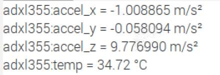
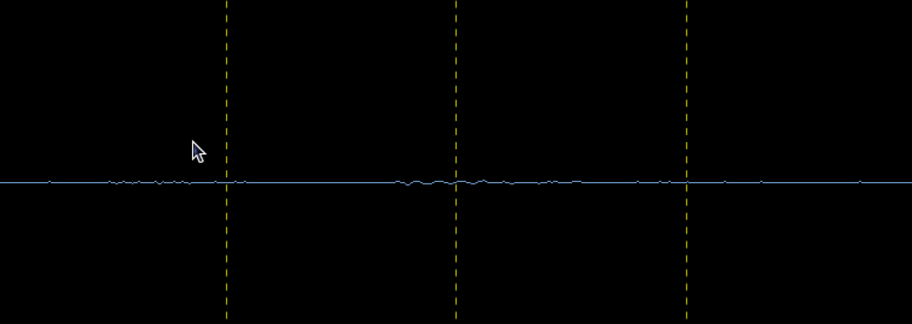
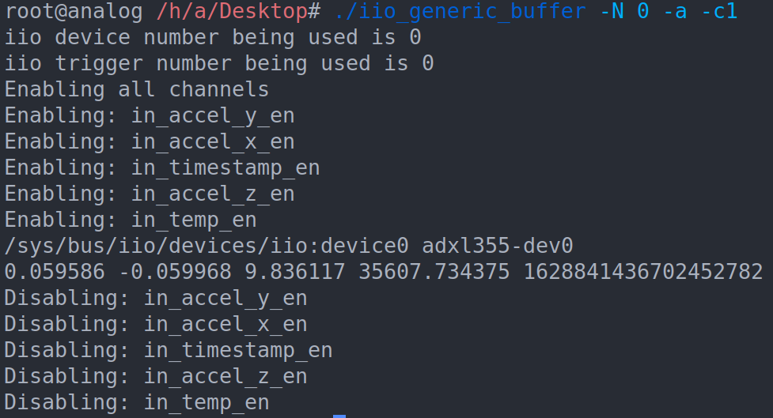

# IIO Driver for Analog Devices' ADXL355 Accelerometer

## Project Overview
IIO Subsystem is the home of Linux sensors, it provides support to ADCs, DACs, Accelerometers,
Temperature sensors, etc. IoT and industrial applications require sensors to monitor and control
different things like motors and actuators. This project aims to implement a driver under the IIO
Subsystem for Analog Devices, Inc.’s (ADI) ADXL355 Accelerometer, merge it upstream to the
kernel tree, and exhibit a working example on Raspberry Pi.

## Goals
- Merge ADXL355's compatible driver upstream to ADI's kernel tree
- Deliver corresponding ABI documentation
- Implement device-tree bindings for ADXL355 in YAML
- Exhibit a working example with the evaluation board on Raspberry Pi 4, utilizing both I2C and SPI protocol.

## Accomplishments
- ADXL355 has support for both I2C and SPI protocols, hence, it would require two separate drivers. The Linux Kernel has an API called Regmap to solve this Problem.
- Used of **Regmap** API to separate the core driver and I2C/SPI communication logic. The core driver uses regmap's read/write APIs to communicate with the sensor and it is unaware of the underlying protocol. This effectively combines two drivers into one and saves a lot of redundant code.
- Allow Single-shot **raw** data capture of acceleration and temperature data. The raw data can be captured by reading the `Sysfs` filesystem of the Linux kernel. 
- Exposed Regmap's debug interface through the `debugfs`. It can be used to read all the registers of the device directly from userspace.
- ADXL355 has support for configurable sampling frequency and low pass filter's -3dB frequency. The driver exposes `_available` attributes for both these so the user can see the available frequencies and select one from them.
- The available -3dB frequencies of the device are dependant on the chosen sampling frequency, hence, the `_available` attribute for the -3dB frequency is re-calculated every time the sampling frequency is changed. 
- Implement **triggered buffer** support where the `DRDY` pin of the device is used as a trigger and data is captured and pushed synchronously.
- The driver was tested by connecting two evaluation boards to the raspberry pi 4. One board was connected through SPI and the other through I2C, both the drivers were loaded and all features were tested.

## Demo
1. IIO Oscilloscope's multimeter was used to check the raw data capture. The multimeter captures the data through the `sysfs` and applies the scale and offset to show the final result in correct units. 
Output of the IIO oscilloscope's multimeter, here I move the board such that each axis faces the top direction in sequence, starting from Z, Y, and then X. The axis that faces the top shows 9.8 and others show zero.

2. IIO Oscilloscope can be used to plot the data that is captured through the triggered buffer.
Here the Oscilloscope is capturing the Z axis data and plotting it. The board is placed on a table. When I tap the table the board experiences an acceleration that can be seen in this gif.

3. The Linux kernel provides a tool called iio_generic_buffer, it can be used to capture the data through the triggered buffer.
Here, iio_generic_buffer is used to capture the tiggered buffer data.

## Patches

### IIO Maintainer's Tree [Upstream]

- [iio: accel: Add driver support for ADXL355](https://git.kernel.org/pub/scm/linux/kernel/git/jic23/iio.git/commit/?h=testing&id=5ffeb17c0d3dd44704b4aee83e297ec07666e4d6)
This patch adds the driver, this doesn't include the triggered buffer support.
- [dt-bindings: iio: accel: Add DT binding doc for ADXL355](https://git.kernel.org/pub/scm/linux/kernel/git/jic23/iio.git/commit/?h=testing&id=3a8ad1ee2991a7b3b99bcf2bcf9f4b4c327cc98e)
This patch adds the yaml documentation for the device-tree.
- [**under review**] [iio: accel: adxl355: Add triggered buffer support](https://patchwork.kernel.org/project/linux-iio/patch/20210819181133.15181-1-puranjay12@gmail.com/)
This patch adds the triggered buffer support, it is under review and will hopefully get merged soon.

## Future Work
- Add FIFO support to the driver.
- Upstream the triggered buffer patch to the IIO subsystem tree.

## Acknowledgement

I'm extremely thankful to...

...my mentors - [Darius Berghe](https://github.com/buha), [Dragos Bogdan](https://github.com/dbogdan), and [Nishant Malpani](https://github.com/layman-n-ish) - for the constant support, guidance, fun weekly audio chats and funding the hardware.

...the folks at Analog Devices, Inc. for casually parting knowledge, from programming tips to internals of the kernel, and reviewing my code.

...the kernel hackers who are a part of the IIO mailing list and also, the maintainer of the IIO subsystem of the Linux kernel, Jonathan Cameron, who all assisted me a great deal to get my patches accepted.

...The Linux Foundation for organizing this learning-heavy IIO project.

...and finally, Google Open Source for orchestrating the GSoC program and ensuring a fruitful, fun-packed summer.
